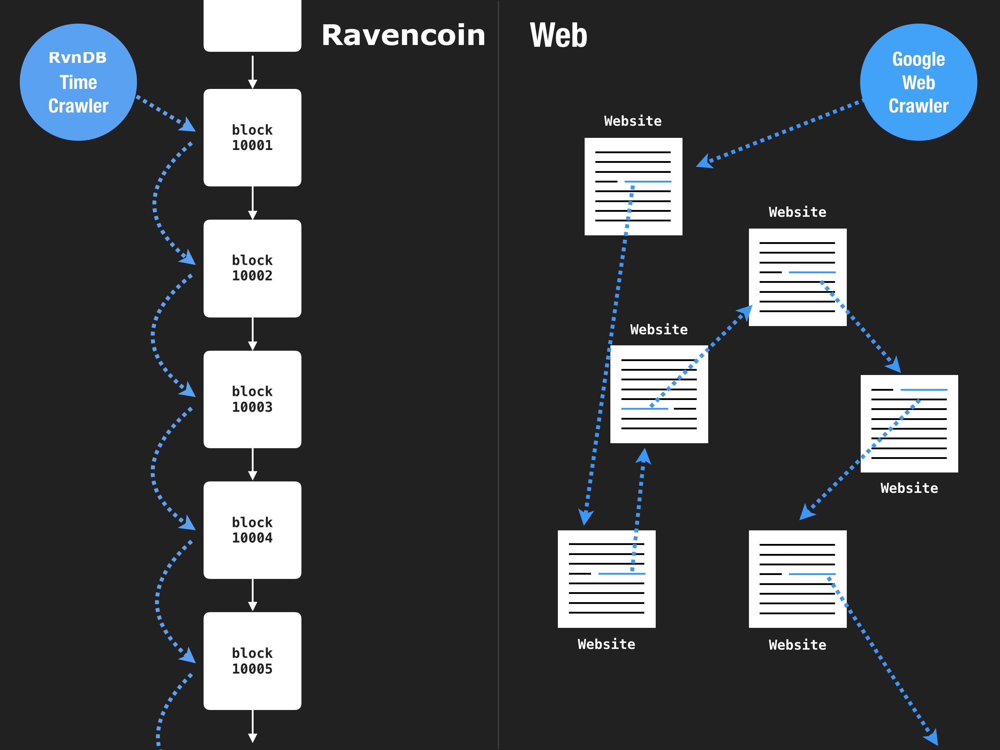

## Time Crawler

> A web search engine crawls links. 
>
> A ravencoin search engine crawls time.

Unlike web search engines like Google which crawl the web by traveling through a network of links, RvnDB indexes ravencoin by traveling through time, linearly.

## Decentralized Crawler

What does it mean to "crawl" and "index" ravencoin? Let's make a comparison to web search engines like Google.

1. Web Search Engines crawl the Web. RvnDB crawls Ravencoin.
2. Web Search Engines crawl through links, RvnDB crawls through time (blocks).
3. Web Search Engines index unstructured data (unstructured natural language content from websites) to create a search index. RvnDB indexes structured data (Ravencoin Transactions) to create a knowledge index.
4. Web Search Engines are designed to be centralized and run as a single website. RvnDB is designed to be decentralized and run as decentralized nodes.

### Centralized Destiny of a Web Crawler

Because web search engines create their index by crawling these non-linear network of links, search engines are only as powerful as their ability to discover content on the web AND the ability to keep storing them.

Also, an index created this way is meant to be used by a single user-facing destination site, which means the search engines are destined to get into a war over user mindshare.

This is one of the reasons why most search engines have died off and we are left with very few, with a near monopolistic leader. It all stems from the fact that the "index" is not a shared property.

### Decentralized Nature of a Ravencoin Crawler

It's a different story when it comes to Ravencoin.

First, RvnDB on its own is not a user-facing product, it's a database engine that powers Ravencoin applications, and those applications are the user-facing products. RvnDB is designed to be decentralized.

Second, every RvnDB node is identical because it's deterministically derived from Ravencoin. It no longer matters who is running a "backend" at any given moment because you can always recover the data from the blockchain.

And as a result, developers are able to build portable applications that don't rely on proprietary servers but are designed to run on whatever RvnDB instance is available at that moment. 

It's a whole new way to define “the cloud".
