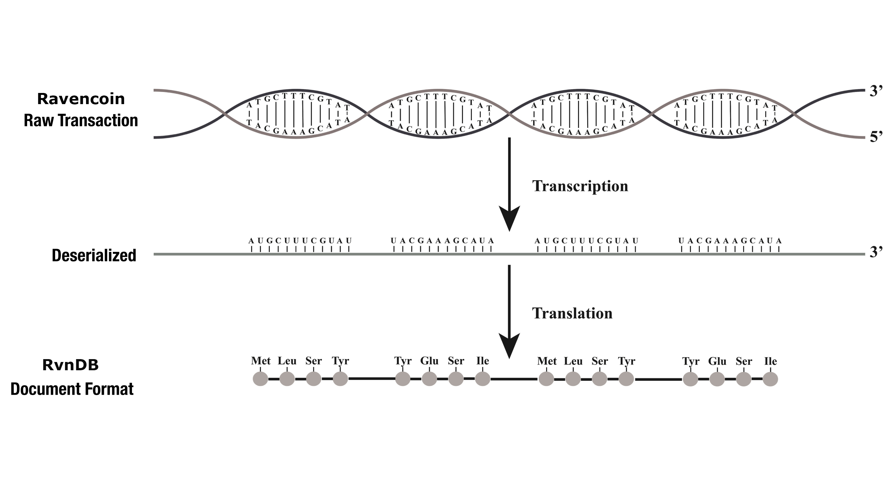
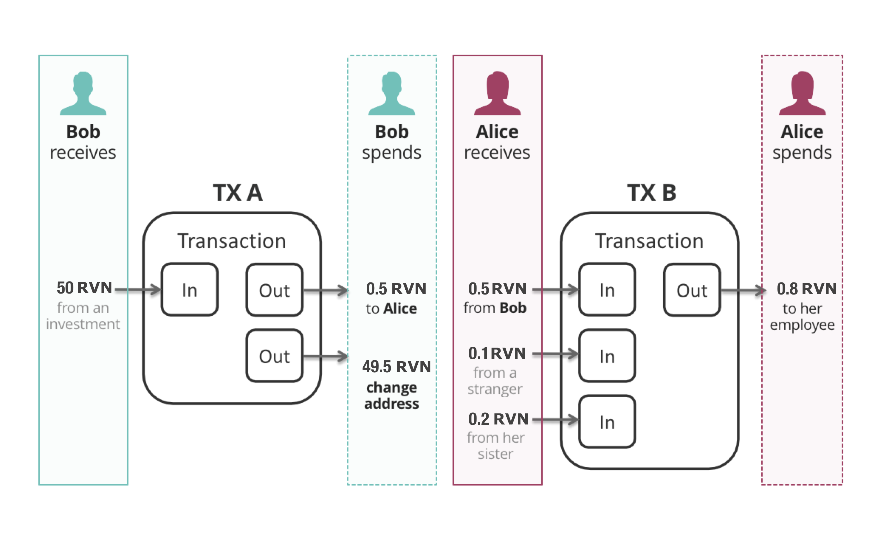
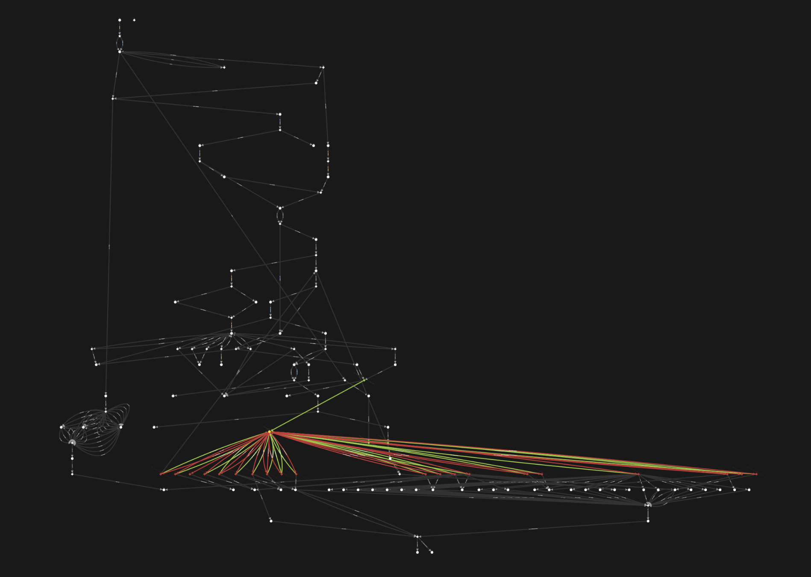

The first task of RvnDB indexer is to take a raw Ravencoin transaction and transform it into a structured format on top of which we can run all kinds of powerful queries.

The second task is to store it into the NoSQL database backend, currently MongoDB.

## 1. How RvnDB parses Ravencoin Transactions

We can think of each ravencoin transaction as a DNA that needs to be expressed into a meaningful protein. This is what RvnDB Indexer does before storing into the database. [View Module](https://github.com/21centurymotorcompany/tna)



For example, here's a raw transaction:

```
0100000001b08acdbdad97ad6670c83cee6794bfbd1e9bb1220b9e6b3116b754bca2459326010000006a47304402201c6039241540945c8c65f3d3ba116dd7b77ea2ca89afac33ef49a8bfa66dafef022035f906ffc1a12613cab7ee1ec9443674f594039c09fce6e59b4f1781e18086f8412103d6d364d31666821548044723f6a8b15f43e6c7dc5edcc2fc3cf7831b3e81095cffffffff020000000000000000176a026d0212706f737420746f206d656d6f2e636173682108420000000000001976a91419b26abab87de1a5d07d34a12f232f5b75c7caf188ac00000000
```

If we deserialize it into a readable format, it has one input script, and two output scripts:

```
# INPUT:
71 0x304402201c6039241540945c8c65f3d3ba116dd7b77ea2ca89afac33ef49a8bfa66dafef022035f906ffc1a12613cab7ee1ec9443674f594039c09fce6e59b4f1781e18086f841 33 0x03d6d364d31666821548044723f6a8b15f43e6c7dc5edcc2fc3cf7831b3e81095c
​
# OUTPUT:
OP_RETURN 2 0x6d02 18 0x706f737420746f206d656d6f2e6361736821
OP_DUP OP_HASH160 20 0x19b26abab87de1a5d07d34a12f232f5b75c7caf1 OP_EQUALVERIFY OP_CHECKSIG
```

This deserialized format is readable but not queryable because it's one dimensional. We need to transform this into a more structured two dimensional format with query-able attributes, along with additional metadata such as transaction hash and block information including `blk.i` (block index), `blk.h` (block hash), `blk.t` (block time):

```
{
  "tx": {
    "h": "92b87fc7390dff0ccfc43469ce90a8d3dbc20e752fdd5cbde55a6d89e230cdf5"
  },
  "blk": {
    "i": 546492,
    "h": "000000000000000000d3ad1ddba37d2d82cd50246e8ed20ee4bbea235d066e25",
    "t": 1536117057
  },
  "in": [
    {
      "i": 0,
      "b0": "MEQCIBxgOSQVQJRcjGXz07oRbde3fqLKia+sM+9JqL+mba/vAiA1+Qb/waEmE8q37h7JRDZ09ZQDnAn85uWbTxeB4YCG+EE=",
      "b1": "A9bTZNMWZoIVSARHI/aosV9D5sfcXtzC/Dz3gxs+gQlc",
      "str": "<Script: 71 0x304402201c6039241540945c8c65f3d3ba116dd7b77ea2ca89afac33ef49a8bfa66dafef022035f906ffc1a12613cab7ee1ec9443674f594039c09fce6e59b4f1781e18086f841 33 0x03d6d364d31666821548044723f6a8b15f43e6c7dc5edcc2fc3cf7831b3e81095c>",
      "e": {
        "h": "269345a2bc54b716316b9e0b22b19b1ebdbf9467ee3cc87066ad97adbdcd8ab0",
        "i": 1,
        "a": "qqvmy646hp77rfws0562zter9adht3727yu7kf3sls"
      }
    }
  ],
  "out": [
    {
      "i": 0,
      "b0": {
        "op": 106
      },
      "b1": "bQI=",
      "s1": "m\u0002",
      "b2": "cG9zdCB0byBtZW1vLmNhc2gh",
      "s2": "post to memo.cash!",
      "str": "<Script: OP_RETURN 2 0x6d02 18 0x706f737420746f206d656d6f2e6361736821>",
      "e": {
        "v": 0,
        "i": 0
      }
    },
    {
      "i": 1,
      "b0": {
        "op": 118
      },
      "b1": {
        "op": 169
      },
      "b2": "GbJqurh94aXQfTShLyMvW3XHyvE=",
      "s2": "\u0019�j��}��}4�/#/[u���",
      "b3": {
        "op": 136
      },
      "b4": {
        "op": 172
      },
      "str": "<Script: OP_DUP OP_HASH160 20 0x19b26abab87de1a5d07d34a12f232f5b75c7caf1 OP_EQUALVERIFY OP_CHECKSIG>",
      "e": {
        "v": 16904,
        "i": 1,
        "a": "qqvmy646hp77rfws0562zter9adht3727yu7kf3sls"
      }
    }
  ]
}
```

<br>

Finally, **THIS** is what gets stored in RvnDB as a row.

<br>

In the sections below, we'll take a look at each attribute of this document format. There are three levels:

1. **Transaction:** The top level object contains **tx**, **blk**, **in**, and **out**.
2. **Script:** **in** represents input scripts, and **out** represents output scripts. These are the core of every transaction as they contain the actual algorithm of each transaction.
3. **Graph:** Each item in the **in** and **out** arrays has an attribute called **e** (stands for "edge") which contains the graph structure of each transaction.
  - **in.e:** (the **e** attribute inside an **in** item) means "incoming edge". It represents the previous linked transaction.
  - **out.e:** (the **e** attribute inside an **out** item) means "outgoing edge". It represents the next linked transaction.

Let's walk through the entire document to see how each level is structured:

## 2. RvnDB Document Format

### Level 1. Transaction

RvnDB represents a transaction as a MongoDB document entry, which follows the following high level format:

```
{
  "tx": {
    "h": [TRANSACTION HASH]
  },
  "blk" {
    "i": [BLOCK INDEX],
    "h": [BLOCK HASH],
    "t": [BLOCK TIME]
  },
  "in": [
    INPUT1,
    INPUT2,
    INPUT3,
    ...
  ],
  "out": [
    OUTPUT1,
    OUTPUT2,
    OUTPUT3,
    ...
  ]
}
```

This is the top level view of what each transaction looks like when it's stored into RvnDB.

- **tx** (short for "transaction"): contains **h** attribute, which is the transaction hash.
- **blk** (short for "block"): contains **i** (block index), **h** (block hash), **t** (block time).

We will discuss the INPUT and OUTPUT script objects in detail in the next section.

### Level 2. Script

Each input and output is essentially a Ravencoin script. We will need to transform a 1-dimensional Ravencoin script that looks like this:

```
OP_DUP OP_HASH160 20 0xfe686b9b2ab589a3cb3368d02211ca1a9b88aa42 OP_EQUALVERIFY OP_CHECKSIG
```

into this:

```
{
  "i": 0,
  "b0": {
    "op": 118
  },
  "b1": {
    "op": 169
  },
  "b2": "/mhrmyq1iaPLM2jQIhHKGpuIqkI=",
  "s2": "�hk�*����3h�\"\u0011�\u001a���B",
  "b3": {
    "op": 136
  },
  "b4": {
    "op": 172
  },
  "str": "<Script: OP_DUP OP_HASH160 20 0xfe686b9b2ab589a3cb3368d02211ca1a9b88aa42 OP_EQUALVERIFY OP_CHECKSIG>",
  "e": {
    "v": 459046,
    "i": 0,
    "a": "qrlxs6um926cng7txd5dqgs3egdfhz92ggrzlp5vsy"
  }
}
```

Here's what each attribute means and how they're constructed:

- **i:** The index of the current script within its parent transaction. One transaction can contain many input/outputs and all input/outputs are ordered within the transaction. This field describes the index of the current script input/output's index.
- **b0, b1, b2, ... :** base64 encoded representation of each push data. There are two rules:
  - **If a push data is an opcode,** it's stored as a JSON object with a single key "op" and its value which corresponds to Ravencoin opcode (Ravencoin opcode table) - (Example: `{ "b0": { "op": 106 } }` is an OP_RETURN opcode)
  - **If a push data is a non-opcode,** it's stored as a base64 encoded string
- **s0, s1, s2, ... :** UTF8 encoded representation of each push data. Used for full text search as well as simple string matching. Only stored if the push data is not an opcode.
- **str**: Full string representation of the script
- **e**: (for inputs) Stands for "graph edge". An array of previous outputs linking to the current transaction.
  - **h**: The hash of the transaction that contains the previous output.
  - **i**: The index of the previous output within its transaction output set.
  - **a**: The sender address in case it can be parsed into an address
- **e**: (for outputs) Stands for "graph edge". An array of all outgoing outputs from the current transaction.
  - **v**: The amount of satoshis sent
  - **i**: The output index within the transaction
  - **a**: The receiver address if the output is linking to an address

### Level 3. Graph

In this section we will take a look at **e** (edge).

There are two edges: **in.e** (input edge) and **out.e** (output edge)

These represent the edges between transactions, one transaction linking to another. Let's take a look at an example to explain these concepts. We'll focus on TX B from the following diagram:



1. TX B (Transaction B) has 3 inputs and 1 output.
2. The first input of 0.5 RVN comes from Bob
3. If we take a look at the part where Bob sends 0.5 RVN to Alice (under "Bob spends") we can see that the 0.5 RVN to Alice is the first output in the transaction (index: 0)

```
{
  "in": [{
    ...
    "e": {
      "a": [Bob address],
      "h": [TX A HASH],
      "i": 0
    }
    ...
  }]
}
```

Basically the sender object represents the output of the previous transaction this input is connected to.

Coming back to TX B and looking at its output, there seems to be only 1 output that pays out 0.8 RVN.

```
{
  "out": [{
    ...
    "e": {
      "a": [Alice's employee address],
      "v": 80000000,
      "i": 0
    }
    ...
  }]
}
```

Note that 0.8 RVN equals to 80,000,000 satoshis, which is why v is 80,000,000. And since the output only has one item, the index of the output is 0.

Wrapping up, the edge objects (both **in.e** and **out.e**) contain the graph structure of all ravencoin transactions. You can then query rvndb to find transactions that match certain graph patterns:

```
{
  "v": 2,
  "q": {
    "find": {
      "in.e.a": [Bob address]
    }
  }
}
```

Or, you can also use MongoDB's [$lookup](https://docs.mongodb.com/manual/reference/operator/aggregation/lookup/) to run JOIN operations, or [$graphLookup](https://docs.mongodb.com/manual/reference/operator/aggregation/graphLookup/) to perform graph database queries.

For example, rvndb's graph data can be used to construct an application-specific overlay graph database, such as [tokengraph.network](https://tokengraph.network), an explorer for [Simple Ledger Protocol](https://simpleledger.cash), a colored coin protocol implementation.


