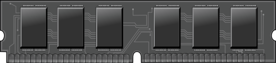
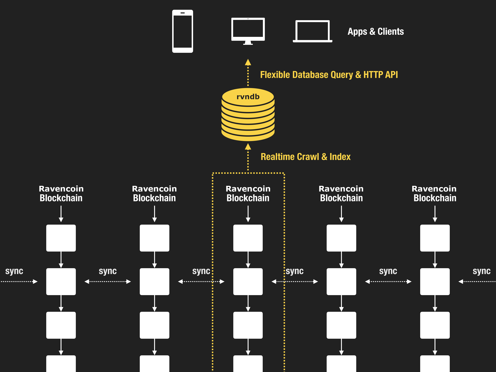
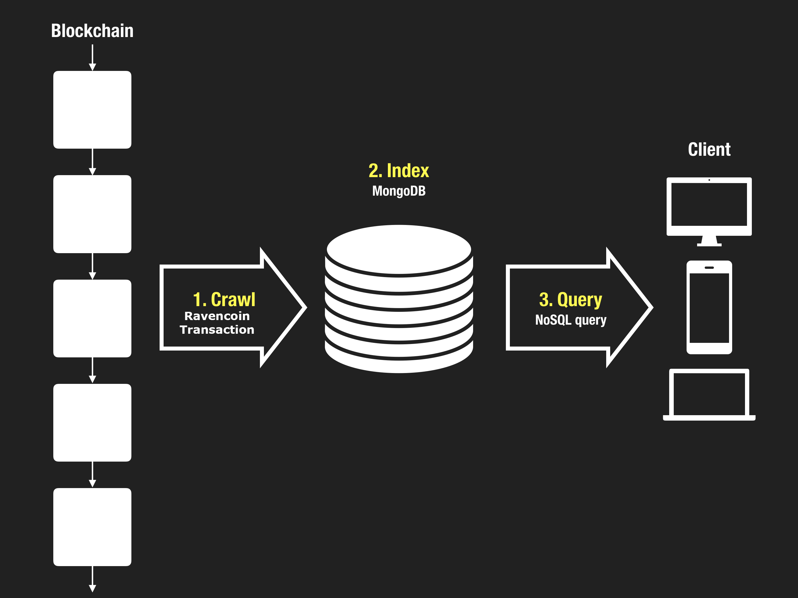
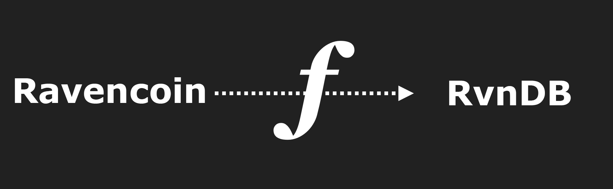

**Random Access Memory for Ravencoin**

[http://rvndb.ravencoin.online](http://rvndb.ravencoin.online)

<br>



<br>

> Ravencoin is the most secure hard disk that will ever exist. 
>
> RvnDB is the memory that lets you make the most out of it.

---

## Hello RvnDB

Before diving in, here are some useful links that may be helpful in your journey with RvnDB:

> **Twitter:** Follow [@MSFTserver](https://twitter.com/MSFTserver) on Twitter for rvndb related announcements
>
>**Github:** [RvnDB Github Repository](https://github.com/raven-community/rvnd). RvnDB is 100% open sourced.

---

## What

RvnDB is an autonomous database that continuously synchronizes itself with Ravencoin, providing a flexible, fast, powerful, and portable query interface into the Ravencoin universe.

By **functioning as a "Memory" to Ravencoin's "Hard Disk"**, RvnDB enables a whole new category of powerful in-memory data processing that used to be impossible with Ravencoin's JSON-RPC alone, and makes it as simple as a MongoDB query.



---

## Why

Why would one need a "Random Access Memory" on top of Ravencoin? What problems does RvnDB solve?

It's actually the same reason why computer systems have RAM (working memory) on top of hard disk (long term memory).

Let's start with an example:

### 1. Problem Example

Ravencoin's transaction inputs and outputs are encoded in a low level language called "script" which looks like this:

```
OP_DUP OP_HASH160 20 0x3e2288390ab7a25cad792e662431db4bda0b9c6b OP_EQUALVERIFY OP_CHECKSIG
```

Ravencoin validates this transaction by walking through this script from left to right, computing each push data based on the opcodes and ravencoin script rules. While this is the simplest and most elegant way to implement programmable money, this elegance comes at a cost:

**Ravencoin script is not optimized for letting the "outside world" make sense of and take programmatic actions through powerful queries into Ravencoin.**

Another way of saying this is: it's not easy to build sophisticated user-facing Ravencoin applications without building out some complex custom backend infrastructure to index and process all the data. For example, trying to find an answer to a problem like the following has been impossible:

```
Find all the transactions that were:
- Sent from the address qq4kp3w3yhhvy4gm4jgeza4vus8vpxgrwc90n8rhxe
- AFTER block 543210
- That contain an OP_RETURN output that contains the text "SLP"
```

This is just one example of what's not easily possible with Ravencoin today, but there are many more.

### 2. Three Types of Databases We Need

While we're at it, let's use our imagination and think of some hypothetical database systems for ravencoin that would be extremely useful to have in the future but don't exist yet:

1. **Ravencoin Transaction Database:** We need a powerful modern database interface for interacting with Ravencoin. Ravencoin's own JSON-RPC API provides some data but it's mostly limited to simple key-value queries about the chain state. It's not meant for massive queries that require huge memory consumption. It doesn't let us query into the entire universe of ravencoin transactions as a whole, and doesn't let us filter transactions using a powerful query language. What we need is an abstraction on top of Ravencoin which most ravencoin application developers don't even need to think about and use like a regular database to build their own decentralized apps.

2. **Ravencoin Script Database:** We need a database of every ravencoin script content from every transaction. This will let us build external applications that seamlessly parse, query, and interact with ravencoin scripts (both input scripts and output scripts) through powerful queries and even use the database to programmatically power real world actions. This database would **index every single push data of every single ravencoin script** and provide a flexible query interface.

3. **Ravencoin Graph Database:** We need a database that keeps track of the entire **graph structure between all ravencoin transactions**, such as which input is connected to which output, which address is connected to which input/outputs, etc. and allow for graph aggregation and traversal queries and analysis.

<br>

Good news: You don't have to wait because it's already here, it's called RvnDB.

RvnDB is all three of those databases in one:

- RvnDB is a [Ravencoin Transaction Database](indexer#level-1-transaction)
- RvnDB is a [Ravencoin Script Database](indexer#level-2-script)
- RvnDB is a [Ravencoin Transaction Graph Database](indexer#level-3-graph)

---

## How

Now let's take a look at how RvnDB actually works, and how it solves all your problems.

### 1. Solution Example

With RvnDB, problems like:

```
Find all the transactions that were:
- Sent from the address qq4kp3w3yhhvy4gm4jgeza4vus8vpxgrwc90n8rhxe
- AFTER block 543210
- That contain an OP_RETURN output that contains the text "SLP"
```

can be solved with a single NoSQL query, as simple as:

```
{
  "v": 2,
  "q": {
    "find": {
      "in.e.a": "qq4kp3w3yhhvy4gm4jgeza4vus8vpxgrwc90n8rhxe",
      "blk.i": {
        "$gt": 543210
      },
      "$text": {
        "$search": "SLP"
      }
    }
  }
}
```

It's just a regular MongoDB query wrapped in a meta-query object "q":

- `"in.e.a"` stands for **input edge address**
- `"blk.i"` stands for **block index**

This type of powerful query is possible because RvnDB crawls, parses, and indexes all Ravencoin transactions in a structured document format, to which you can run any complex queries.

> Learn more about RvnDB Document Format [here](http://docs.rvndb.ravencoin.online/docs/indexer)
>
> Learn more about RvnDB Query Language [here](http://docs.rvndb.ravencoin.online/docs/query_v3)

Also, since the query language itself is JSON, the query is portable, can be implemented in any programming language, and can even be sent over HTTP. RvnDB nodes can provide HTTP API endpoints that decentralized 3rd party applications can connect to.

The standardized database query language protocol ensures that your app lives on forever even after you move on, because all that's required to run the application is the query, which itself is portable because of its declarative nature.

And just the fact that this is possible gives users the trust that their favorite decentralized app won't just disappear tomorrow.

### 2. Architecture Overview



Here's a high level overview of RvnDB:

1. **[Crawler](crawler):** RvnDB crawls through every ravencoin transaction on the blockchain and turns ravencoin's 1-dimensional script into a 2-dimensional JSON object.
2. **[Indexer](indexer):** The deserialized JSON object is stored and indexed in a NoSQL database.
3. **[Query Engine](query):** Once the data is stored, it becomes trivial to make flexible filtering, aggregation, full text search, and graph queries.

### 3. RvnDB is Readonly

Humans can't directly write to RvnDB. The only "user" with "write" permission to RvnDB is **Ravencoin** itself.

RvnDB utilizes Ravencoin as the single source of truth and doesn't require any human intervention once it starts running as an autonomous daemon because it's a self-contained crawler + parser + indexer + query engine, all in one. 


With this approach, the "database" is merely an index built from the canonical Ravencoin blockchain, just like how web search engines are merely indexes built from websites they crawl and the "source of truth" is always the original website.

### 4. Writing to Ravencoin

So if Ravencoin is the only entity that can write to RvnDB, how can a lowly human being get data into RvnDB?

Simple, you go directly to the source (Ravencoin) and write to it. And how do you write to Ravencoin? Make a Ravencoin transaction!

You'll see that RvnDB immediately synchronizes with Ravencoin and your transaction shows up on RvnDB instantly. Here are some libraries that provide various flexible ways to WRITE to Ravencoin:

<div class='well'>

#### i. RvnBox SDK

http://developer.ravencoin.online/rvnbox


---

#### ii. Ravencoin.js

https://ravencoinjs.ravencoin.online/


</div>

### 5. RvnDB is Ravencoin

In essence, RvnDB is a database constructed by a one-way synchronization function that transforms a raw Ravencoin transaction into a structured data format that can be queried against.



This means we can reconstruct identical RvnDB databases as many times as we want from Ravencoin. If there's a nuclear war and every single RvnDB node goes down, as long as there are Ravencoin nodes running, you can recover from the destruction by traversing the transform function through time (ie: the blockchain).

- Because RvnDB is backed by Ravencoin as canonical storage, it comes with all the benefits of Ravencoin's decentralization (Anyone can reconstruct and run a RvnDB node from scratch as long as they have a Ravencoin node)

- Because RvnDB is powered by MongoDB as index, it comes with all the benefits of NoSQL databases, such as highly flexible and portable query interface and better user experience.


